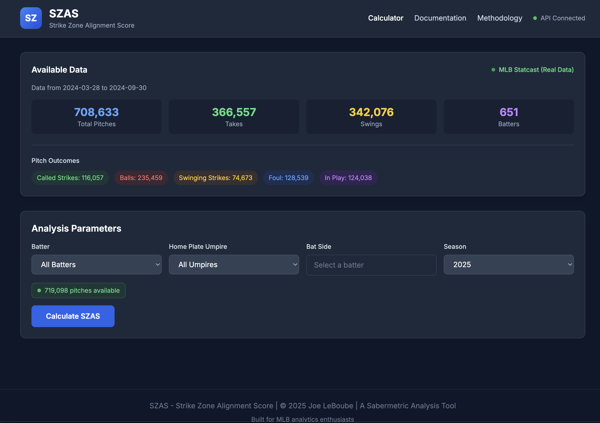
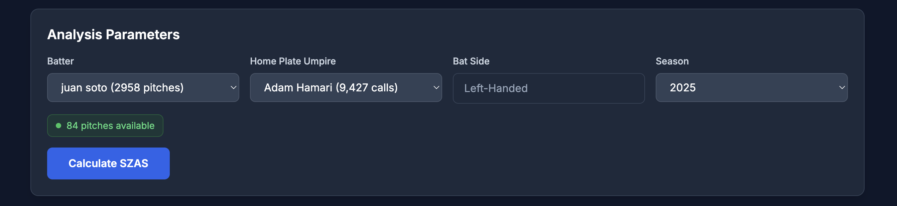
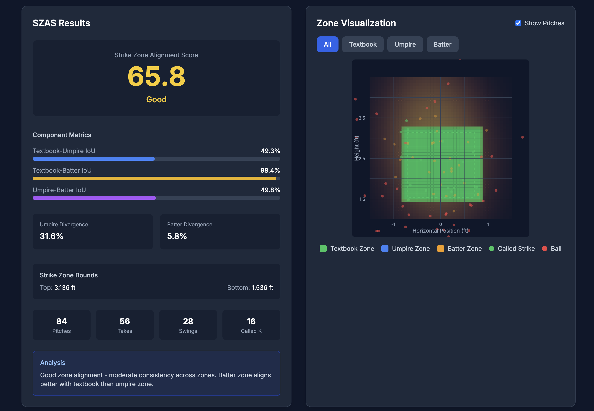
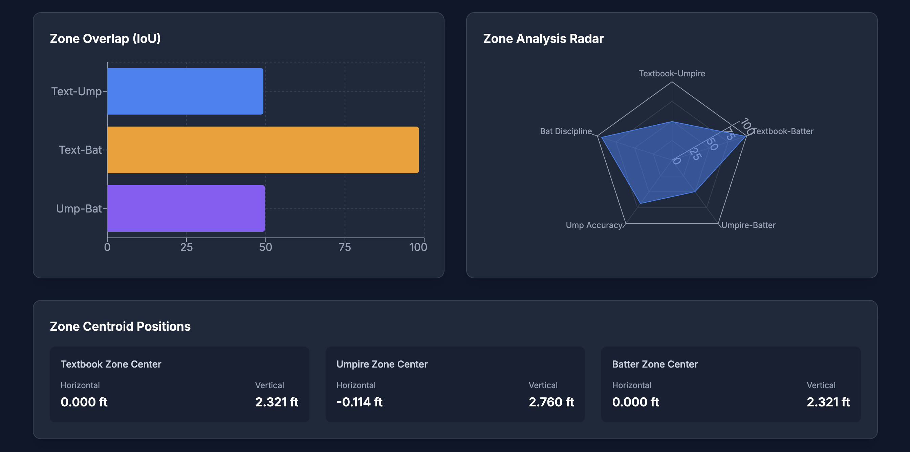
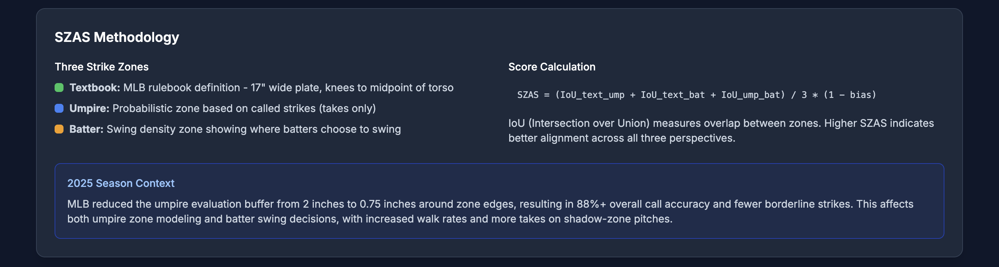

# SZAS - Strike Zone Alignment Score

<div align="center">

[](https://docs.docker.com/compose/)
[](https://github.com/jleboube/Strike-Zone-Alignment-Score/stargazers)
[](https://github.com/jleboube/Strike-Zone-Alignment-Score/network/members)
[](https://github.com/jleboube/Strike-Zone-Alignment-Score/issues)
[](https://github.com/jleboube/Strike-Zone-Alignment-Score/pulls)
[](https://creativecommons.org/licenses/by-nc-sa/4.0/)

[](https://www.buymeacoffee.com/muscl3n3rd)


A Sabermetric web application for analyzing MLB strike zone dynamics. SZAS quantifies the alignment and divergences among three distinct strike zones: the textbook rulebook zone, the umpire-called zone, and the batter-swing zone.

[Demo](https://szas.baseballstatsclub.com) • [Screenshots](#screenshots) • [Features](#features) • [Quick Start](#quick-start)


</div>

## Screenshots

Strike Zone Alignment Score Landing Page



SZAS Parameters



SZAS Results




SZAS Methodology




## Features

- **SZAS Calculation**: Compute the Strike Zone Alignment Score for any batter-umpire combination
- **Zone Modeling**: Probabilistic models for textbook, umpire, and batter strike zones
- **Interactive Visualization**: Heatmaps and overlays showing zone differences
- **2025 Rule Context**: Incorporates MLB's tighter evaluation buffer (0.75" vs 2")

## Quick Start

### Prerequisites

- Docker and Docker Compose installed
- Ports 15847 and 16392 available (or configure custom ports)

### Running the Application

1. Copy the environment file:
   ```bash
   cp .env.example .env
   ```

2. Build and start the containers:
   ```bash
   docker-compose build
   docker-compose up -d
   ```

3. Access the application:
   - **Web UI**: http://localhost:15847
   - **API**: http://localhost:16392/api/health

### Configuration

Edit `.env` to customize ports:

```env
WEB_PORT=15847   # Frontend port
API_PORT=16392   # Backend API port
FLASK_DEBUG=false
```

## API Endpoints

| Endpoint | Method | Description |
|----------|--------|-------------|
| `/api/health` | GET | Health check |
| `/api/szas/calculate` | POST | Calculate SZAS score |
| `/api/szas/zones` | POST | Get zone probability surfaces |
| `/api/data/batters` | GET | List available batters |
| `/api/data/umpires` | GET | List available umpires |
| `/api/data/summary` | GET | Data summary statistics |

### Calculate SZAS

```bash
curl -X POST http://localhost:16392/api/szas/calculate \
  -H "Content-Type: application/json" \
  -d '{"batter_id": 660271, "year": 2024, "use_sample_data": true}'
```

## SZAS Methodology

### The Three Strike Zones

1. **Textbook Zone**: MLB rulebook definition
   - Width: 17 inches over the plate
   - Height: Knees to midpoint between shoulders and belt

2. **Umpire Zone**: Probabilistic model from called pitches
   - Based on takes (called strikes and balls)
   - Uses logistic regression: P(strike | px, pz)

3. **Batter Zone**: Swing density model
   - Based on swing attempts
   - Shows where batters choose to swing

### SZAS Formula

```
SZAS = (IoU_text_ump + IoU_text_bat + IoU_ump_bat) / 3 * (1 - bias)
```

Where:
- **IoU** = Intersection over Union between zone pairs
- **bias** = Influence coefficient (typically 0, per research)

### Score Interpretation

| Score | Rating | Meaning |
|-------|--------|---------|
| 0.8+ | Excellent | High alignment across all zones |
| 0.6-0.8 | Good | Moderate consistency |
| 0.4-0.6 | Fair | Some divergence between zones |
| <0.4 | Poor | Significant zone disagreement |

## Project Structure

```
SZAS/
├── backend/
│   ├── app.py              # Flask API
│   ├── szas_calculator.py  # SZAS calculation engine
│   ├── data_loader.py      # Data fetching/generation
│   ├── requirements.txt
│   └── Dockerfile
├── frontend/
│   ├── src/
│   │   ├── App.jsx
│   │   └── components/
│   │       ├── Dashboard.jsx
│   │       ├── ZoneVisualization.jsx
│   │       ├── ResultsPanel.jsx
│   │       └── ...
│   ├── nginx.conf
│   └── Dockerfile
├── data/                   # Sample and cached data
├── docker-compose.yml
├── .env.example
└── README.md
```

## Development

### Local Backend Development

```bash
cd backend
python -m venv venv
source venv/bin/activate
pip install -r requirements.txt
python app.py
```

### Local Frontend Development

```bash
cd frontend
npm install
npm run dev
```

## Data Sources

The application supports:

1. **Sample Data**: Synthetically generated realistic pitch data
2. **Statcast Data**: Via pybaseball library (requires internet)

To fetch real data, set `use_sample_data: false` in API requests.

## 2025 Season Context

MLB reduced the umpire evaluation buffer from 2 inches to 0.75 inches around zone edges, resulting in:
- 88%+ overall call accuracy
- 82% accuracy in shadow zones
- Increased walk rates
- More takes on edge pitches

## Tech Stack

- **Backend**: Python, Flask, Pandas, Scikit-learn, NumPy
- **Frontend**: React 18, Vite, Tailwind CSS, Recharts
- **Infrastructure**: Docker, Nginx, Gunicorn

## Contributing

1. Fork the repository
2. Create a feature branch
3. Make your changes
4. Submit a pull request

## License

MIT License

## Acknowledgments

- MLB Statcast for pitch tracking data
- Baseball Savant for public data access
- The sabermetrics community for analytical frameworks
